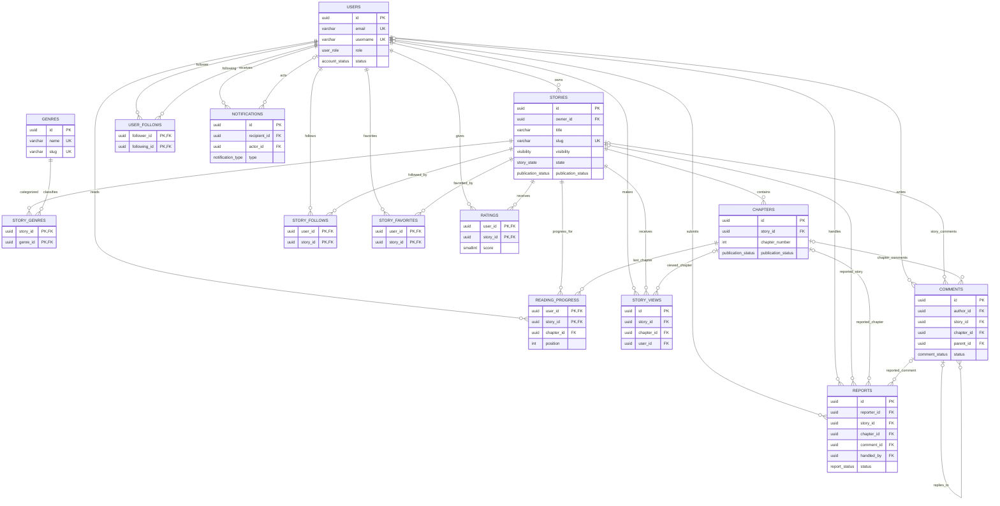

# ERD — Story Nest

## Ghi chú

- `STORY_GENRES` là bảng trung gian cho quan hệ nhiều-nhiều giữa truyện và thể loại.
- `STORY_FOLLOWS`, `STORY_FAVORITES`, `USER_FOLLOWS` và `RATINGS` dùng khóa chính ghép để không tạo tương tác trùng lặp.
- Một `COMMENTS` phải thuộc đúng một trong hai đối tượng: `STORIES` hoặc `CHAPTERS`; `parent_id` hỗ trợ bình luận trả lời.
- Một `REPORTS` phải báo cáo đúng một trong ba đối tượng: truyện, chương hoặc bình luận.
- `READING_PROGRESS` lưu chương và vị trí đọc gần nhất cho từng cặp người dùng–truyện.
